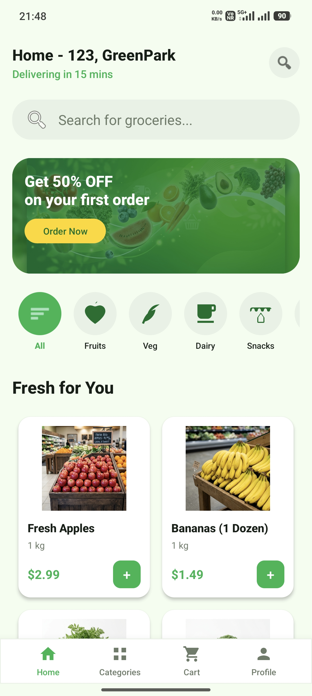
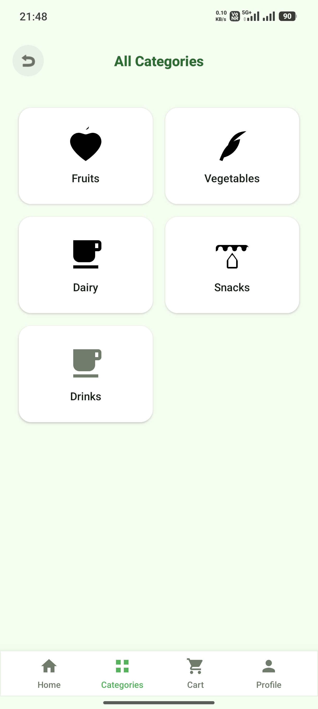
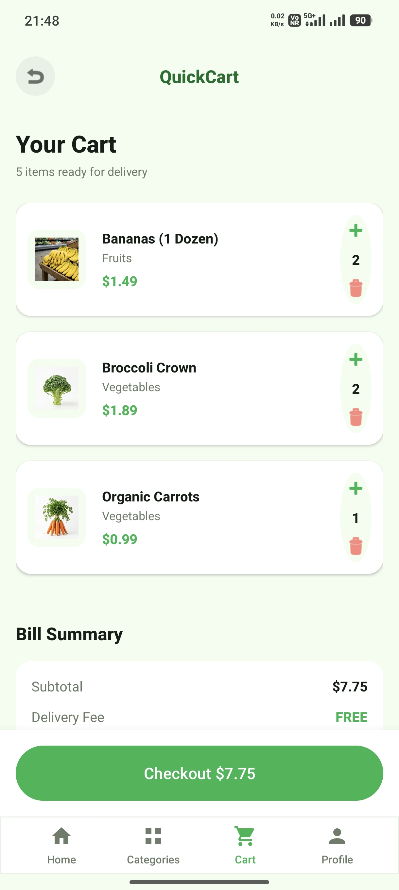
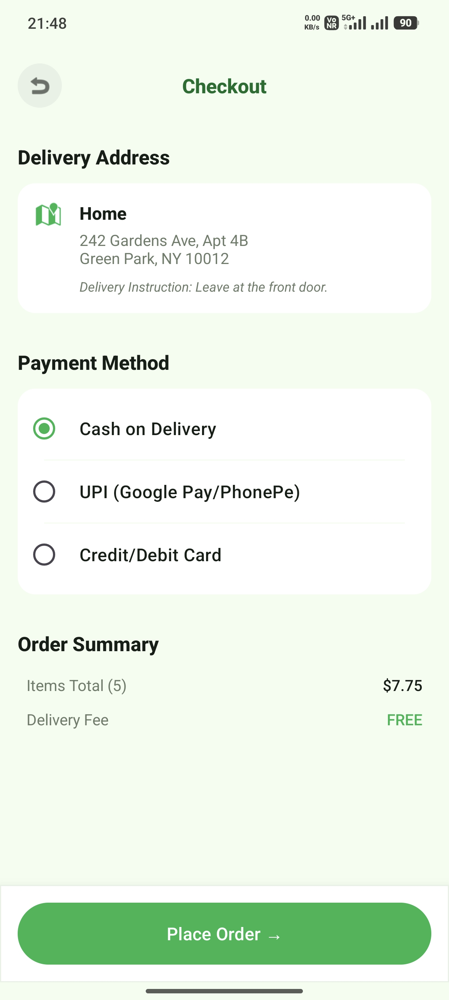
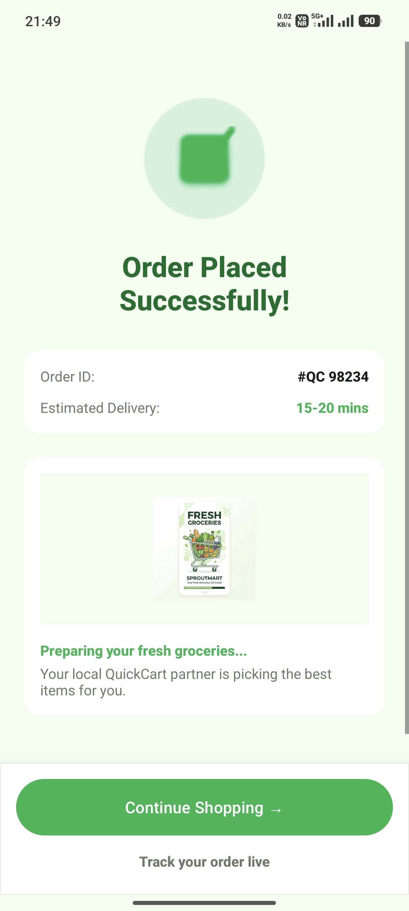
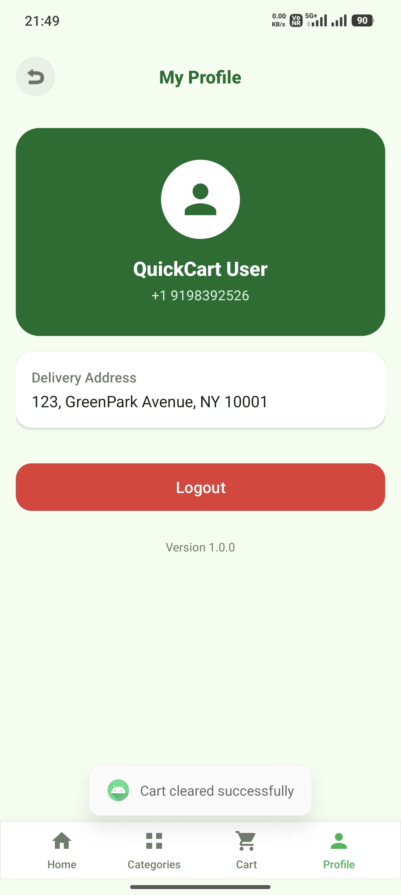
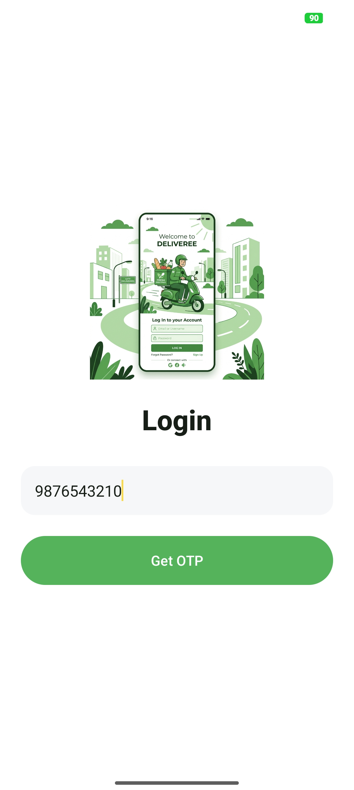
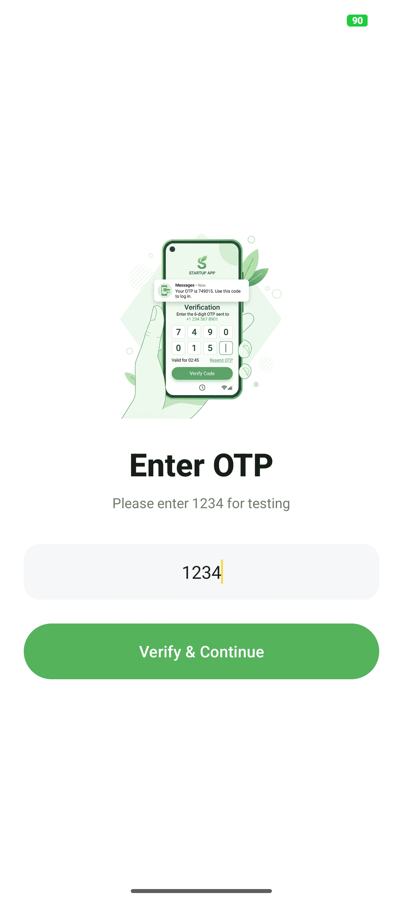
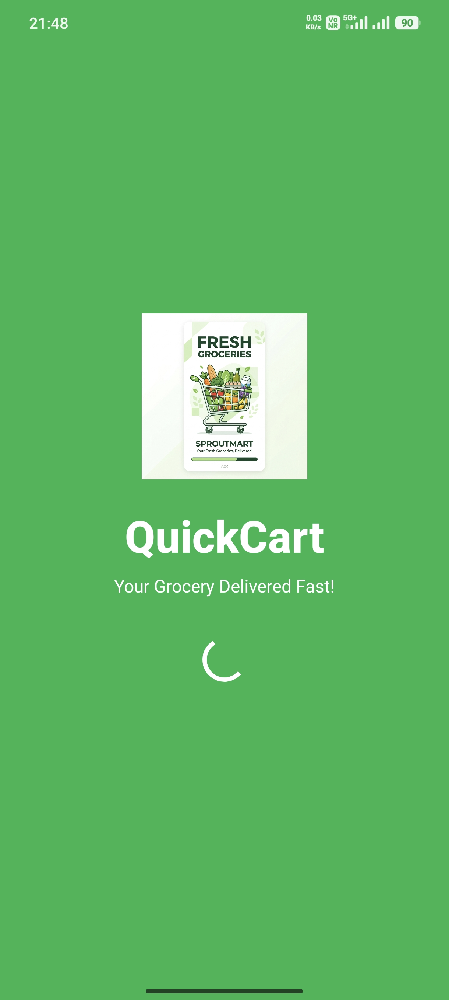

# QuickCart 🛒

QuickCart is a modern Android grocery shopping application built using **Kotlin** and **XML**.  
The app provides a smooth grocery shopping experience with OTP authentication, real-time cart management, category filtering, and a clean modern UI inspired by quick commerce apps.

---

# ✨ Features

- 🔐 OTP Login Authentication
- 💾 Persistent Login Session
- 🛍️ Grocery Product Listing
- 📂 Category Filtering
- 🛒 Real-time Cart Updates
- ➕ Quantity Management
- 💳 Checkout Flow
- ✅ Order Success Screen
- 👤 Profile Management
- 📱 Bottom Navigation
- 🎨 Modern Responsive UI
- ⚡ Smooth Navigation Experience

---

# 🛠️ Tech Stack

- Kotlin
- Android SDK
- XML Layouts
- RecyclerView
- SharedPreferences
- ConstraintLayout
- Material Design Components

---

# 📱 App Screens

- Splash Screen
- Login Screen
- OTP Verification
- Home Screen
- Categories Screen
- Cart Screen
- Checkout Screen
- Order Success Screen
- Profile Screen

---

# 📸 App Screenshots

## 🏠 Home Screen
<p align="center">
  
</p>

---

## 📂 Categories Screen
<p align="center">
  
</p>

---

## 🛒 Cart Screen
<p align="center">
  
</p>

---

## 💳 Checkout Screen
<p align="center">
  
</p>

---

## ✅ Order Success Screen
<p align="center">
  
</p>

---

## 👤 Profile Screen
<p align="center">
  
</p>

---

## 🔐 Login Screen
<p align="center">
  
</p>

---

## 📱 OTP Verification Screen
<p align="center">
  
</p>

---

## 🚀 Splash Screen
<p align="center">
  
</p>

---

# 📁 Project Structure

```bash
app/
 ├── adapter/
 ├── model/
 ├── ui/
 │    ├── home/
 │    ├── cart/
 │    ├── categories/
 │    ├── checkout/
 │    ├── login/
 │    └── profile/
 ├── utils/
 └── res/
```

---

# ⚙️ Installation

## Clone Repository

```bash
git clone https://github.com/programmer-kunal/QuickCart.git
```

## Open Project

- Open Android Studio
- Click **Open**
- Select the cloned QuickCart project folder

## Build & Run

- Sync Gradle
- Connect Android device/emulator
- Click ▶ Run

---

# 👨‍💻 Author

**Kunal**

- GitHub: https://github.com/programmer-kunal

---

# ⭐ If you like this project

Give this repository a ⭐ on GitHub.
